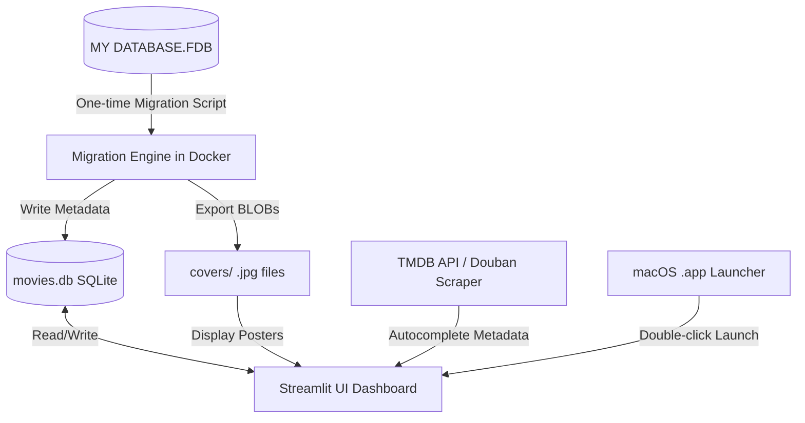

# Design Spec: Movie Database Revival (Movie Label FDB to SQLite + Streamlit App)

## 1. Goal & Context
Revive a legacy Windows "Movie Label" database (`MY DATABASE.FDB`, 757MB) on macOS. The database contains several hundred movie entries, including hand-added covers (stored as binary BLOBs), metadata, physical media paths, and watch statuses. A significant number of entries are incomplete or have names only.
We will migrate the data to a modern, zero-dependency SQLite database, extract the covers as local `.jpg` files, build a beautiful local dark-themed Streamlit dashboard to manage and autocomplete movie entries (using TMDB & Douban), and package the whole system as a standalone macOS `.app` with a custom icon.

---

## 2. System Architecture

---

## 3. Database Schema Design (SQLite: `movies.db`)

We will create a `movies` table containing the following fields:

| Column Name | SQLite Data Type | Description |
| :--- | :--- | :--- |
| `id` | INTEGER PRIMARY KEY AUTOINCREMENT | Unique movie identifier |
| `title` | TEXT | Primary title of the movie |
| `original_title`| TEXT | Original language title |
| `director` | TEXT | Movie director(s) (comma-separated) |
| `actors` | TEXT | Main cast members (comma-separated) |
| `genres` | TEXT | Movie genres (comma-separated) |
| `year` | INTEGER | Release year |
| `runtime` | INTEGER | Running time in minutes |
| `country` | TEXT | Country of origin |
| `plot` | TEXT | Synopsis/Plot summary |
| `imdb_id` | TEXT | IMDb Movie ID (e.g., `tt0111161`) |
| `imdb_rating` | REAL | IMDb Rating (0.0 to 10.0) |
| `douban_id` | TEXT | Douban Movie ID (e.g., `1292052`) |
| `douban_rating` | REAL | Douban Rating (0.0 to 10.0) |
| `tmdb_id` | TEXT | TMDB Movie ID |
| `physical_path` | TEXT | Physical disc location or local file path |
| `watch_status` | TEXT | Watch status (`Seen` / `Unseen`) |
| `created_at` | DATETIME | Entry creation timestamp |
| `updated_at` | DATETIME | Last update timestamp |

---

## 4. Components & Workflows

### Phase 1: Firebird Schema Detection & Migration
1. **Docker Setup**: Spin up a temporary Firebird 3.0 container:
   - Command: `docker run -d --name firebird-migrator -p 3050:3050 -v "/Users/shanfu/Movie Label Databases:/db" jacobalberty/firebird:3.0`
2. **Schema Extraction**: Run a Python script `detect_schema.py` using `firebirdsql` to inspect system tables (`RDB$RELATIONS`, `RDB$RELATION_FIELDS`) and print all table structures.
3. **Migration Engine (`migrate.py`)**:
   - Establish connection to Firebird on `localhost:3050` with `/db/MY DATABASE.FDB`.
   - Read movies, metadata, physical paths, and watch status.
   - For covers, fetch the BLOB columns and save them as `Projects/movie-database-revival/covers/<movie_id>.jpg`.
   - Insert all structured data into `Projects/movie-database-revival/movies.db`.
   - Safely stop and destroy the Docker migrator container.

### Phase 2: Streamlit Dashboard App (`app.py`)
1. **Movie Grid & Posters**: Responsive card grid of posters. If poster is missing, display a clean dark placeholder with the movie's initials.
2. **Filters & Search**: Fast search bar + sidebar filters (Year, Genre, Watch Status, Physical Path presence).
3. **Detail & Editing Mode**: Sidebar/modal detailing movie info, allowing manual edits of any field (particularly paths and watch status).
4. **Metadata Auto-Complete**:
   - Input TMDB/Douban IDs or search by Title.
   - Query TMDB API (using user's key) or scrape Douban for Chinese ratings, plots, and high-res poster files.
   - One-click apply updates to SQLite and overwrites the local `covers/<movie_id>.jpg`.

### Phase 3: Standalone macOS Launcher Wrapper
1. **Launcher Creation**: Use `macos-app-launcher` to scaffold a `.app` wrapper around the Streamlit project.
2. **Double-click Execution**: The launcher starts `streamlit run app.py` in the background and opens the web view automatically. It gracefully kills the background Streamlit process when the user closes the app.
3. **Custom Icon**: Design a premium vintage-modern movie database icon (`.icns` file) and bundle it inside the app.

---

## 5. Verification Plan
- **Migration Verification**: Verify that the sqlite table `movies` has the same number of rows as the legacy database, and `covers/` contains the correct number of extracted `.jpg` files.
- **Functional Testing**: Test database reads, edits, updates, autocompleting via TMDB/Douban, and manual addition of new entries.
- **Launcher Packaging**: Ensure double-clicking the `.app` successfully launches the app and closing it cleans up the ports.
